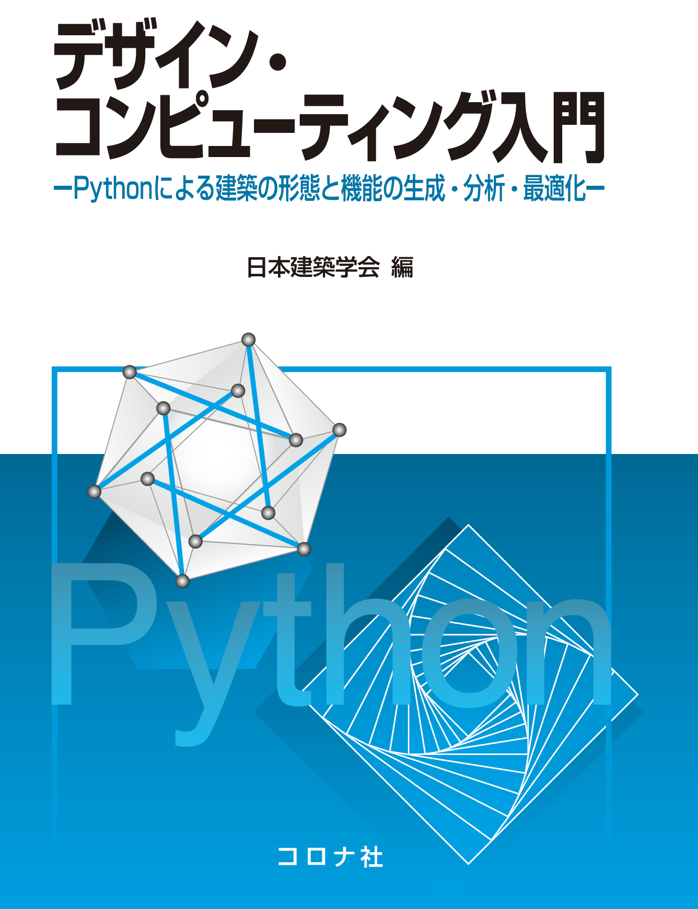

<!--
2017.8.4 Kei Yasuda
## タスクリスト
* tagリンク
-->

# デザインコンピューティング入門   -Pythonによる建築の形態と機能の生成・分析・最適化-

## はじめに

本書ではプログラム言語Pythonを用いて建築の研究や設計に用いられる代表的な数理的手法のいくつかを解説します。私たちは数理的手法を使いこなして建築の研究や設計に活かしたいと思っている人たちを対象に本書を制作しました。形態生成，最適化，知識処理などの数理的手法の要点を説明し，それらをPythonによってプログラミングする方法を解説します。数理的手法の説明を読み，自分の手でプログラムを書いてみることが数理的手法を使いこなすための一歩になると考えています。

## 書籍について
 
  
コロナ社url: http://www.coronasha.co.jp/np/isbn/9784339052541/  
Amazon url: http://amzn.asia/jfA26tH  
出版社: コロナ社  
言語: 日本語  
ISBN-10: 433905254X  
ISBN-13: 78-4339052541  
発売日： 2017/09/06  
編者: 日本建築学会　情報システム技術委員会　デザイン科学教育方法研究小委員会  
### 著者  

|氏名|所属(出版時)|
|---------|---------------------------------|
|大崎　　純	|京都大学大学院工学研究科建築学専攻|
|小林　祐貴	|東京工業大学環境・社会理工学院 建築学系|
|長坂　一郎	|神戸大学大学院人文学研究科|
|藤井　晴行	|東京工業大学環境・社会理工学院 建築学系|
|藤田慎之輔	|東京工業大学科学技術創成研究院|
|水谷　晃啓	|豊橋技術科学大学建築・都市システム学系|
|安田　　渓	|京都大学大学院工学研究科建築学専攻|
|渡辺　　俊	|筑波大学システム情報系社会工学域|

### 目次

**第１章**　デザイン科学とコンピューティング  
**第２章**　Python 入門  
**第３章**　形態の生成  
**第４章**　分析  
**第５章**　形態と性能の最適化  
**第６章**　デザインに関する知識の処理  
**第７章**　コンピューテーショナル・デザインの事例

## このリポジトリの目的

* 『デザインコンピューティング入門 -Pythonによる建築の携帯と昨日の生成・分析・最適化-』で用いているプログラムコードを共有します。
* 書籍初版時点のソースコードのバージョンは「[v_1.0](https://github.com/o-kei/design-computing-aij/releases/tag/v_1.0)」にあります。
* 最新安定版は「[master](https://github.com/o-kei/design-computing-aij/tree/master)」です。
* Python3.5、WindowsおよびOSXで実行確認しています。

## セットアップ方法

* ダウンロードして利用してください。
* 実行するのに必要なライブラリは章ごとに異なります。本書で解説しています。
* プログラムによっては，そのプログラムの置いてあるディレクトリに移動して実行する必要があります。

## 改訂ガイドライン

* 基本的には共著者はCollaboratorとして修正できますので、エラーなどある場合は直接共著者に伝えるか、もしくはPull Requestを送ってください。
* 共著者は各自の担当部分については各自の判断でmasterにコミット、ほかの部分については軽微な変更はmasterにコミットして著者に知らせるか、適宜branchを作成して変更し、後で著者に知らせながらmasterにmergeしてください。
* 共著者が授業やセミナーで扱う場合は、その授業用のbranchを作成して進めてもいいかもしれません。
* 文字コードはutf-8に指定してください。 
* 改行コードは環境に合わせてください。 ダウンロード時に環境にあわせて自動的に修正されるようですので、あまり気にせず問題ありません。
* .gitignoreで、`__pycache__`フォルダ、testフォルダ、.bak .pyc など実行時に生成されるが関係のないファイル、フォルダ、テスト・バックアップ用フォルダは同期しないように設定しています。必要であれば.gitignoreファイルを修正してください。

## プログラムコードのLicense
MIT

---
以下MITライセンス日本語訳参考
https://ja.osdn.net/projects/opensource/wiki/licenses%2FMIT_license

以下に定める条件に従い、本ソフトウェアおよび関連文書のファイル（以下「ソフトウェア」）の複製を取得するすべての人に対し、ソフトウェアを無制限に扱うことを無償で許可します。これには、ソフトウェアの複製を使用、複写、変更、結合、掲載、頒布、サブライセンス、および/または販売する権利、およびソフトウェアを提供する相手に同じことを許可する権利も無制限に含まれます。

上記の著作権表示および本許諾表示を、ソフトウェアのすべての複製または重要な部分に記載するものとします。

ソフトウェアは「現状のまま」で、明示であるか暗黙であるかを問わず、何らの保証もなく提供されます。ここでいう保証とは、商品性、特定の目的への適合性、および権利非侵害についての保証も含みますが、それに限定されるものではありません。 作者または著作権者は、契約行為、不法行為、またはそれ以外であろうと、ソフトウェアに起因または関連し、あるいはソフトウェアの使用またはその他の扱いによって生じる一切の請求、損害、その他の義務について何らの責任も負わないものとします。